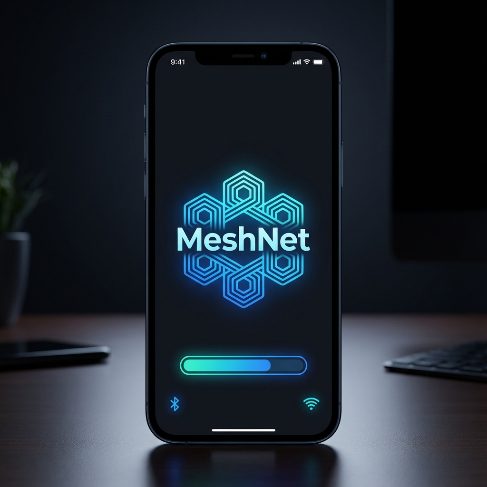
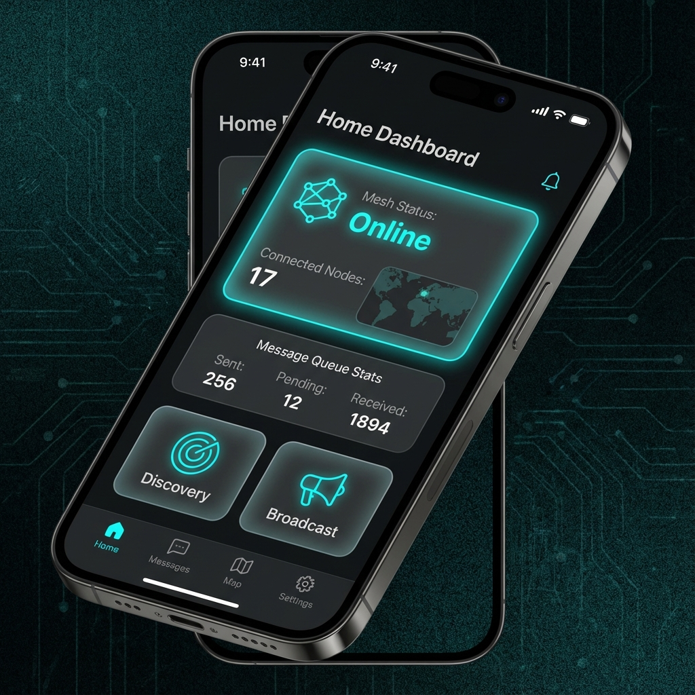
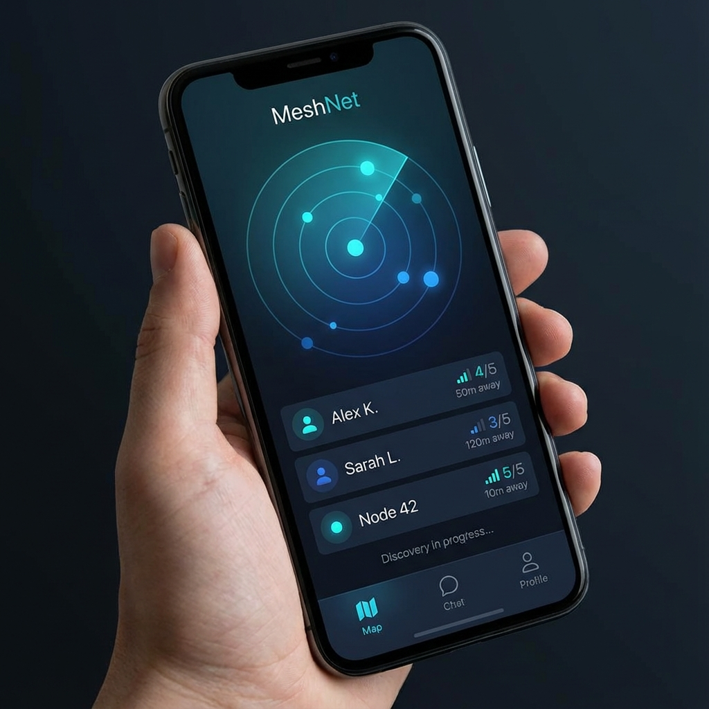
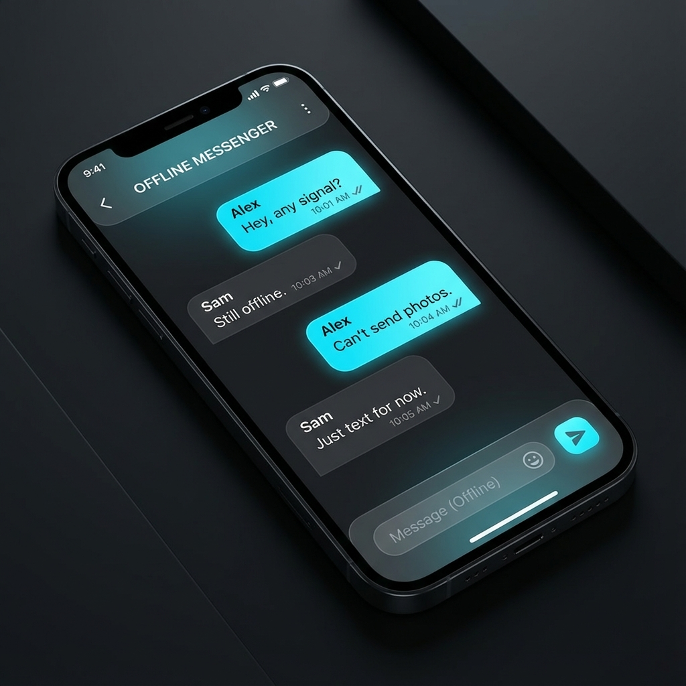
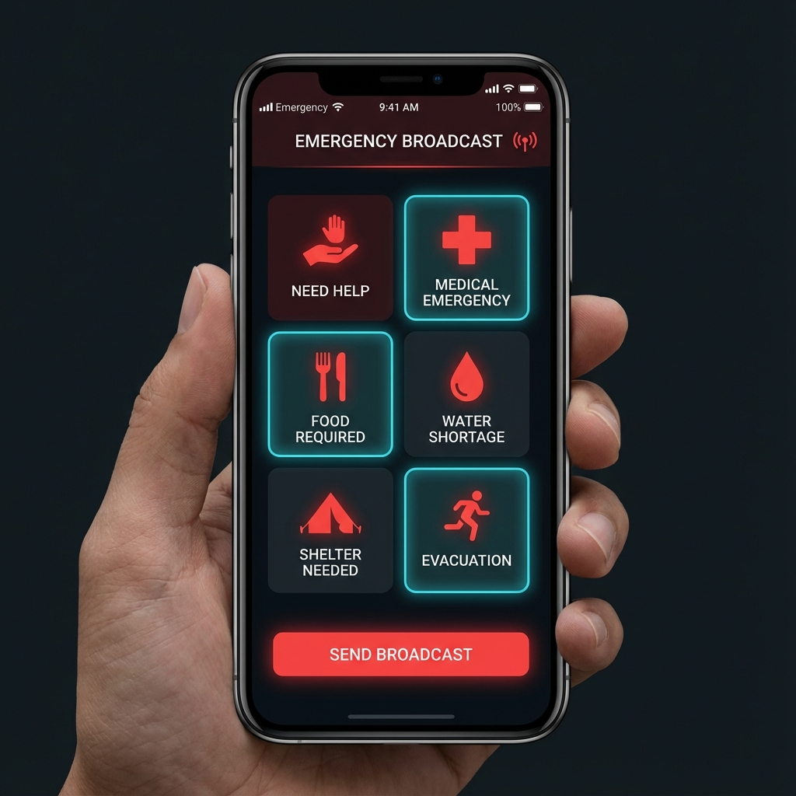
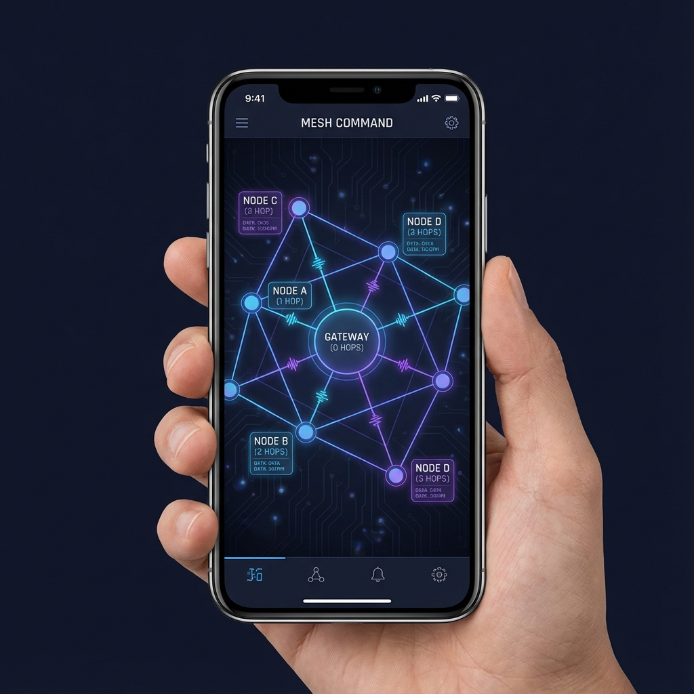
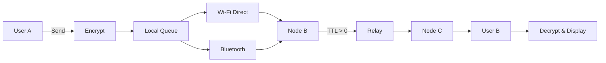

<div align="center">

# 📡 MeshNet - Offline Mesh Messaging


### 🌐 Decentralized Offline Communication for Everyone

[](https://flutter.dev)
[](https://dart.dev)
[](LICENSE)
[](CONTRIBUTING.md)
[](https://github.com/Mohammad007/mesh_networking_app)
[](https://github.com/Mohammad007/mesh_networking_app/fork)

**Stay connected when the internet goes down. No servers. No internet. Just peer-to-peer mesh networking.**

[Features](#-features) • [Screenshots](#-screenshots) • [Installation](#-installation) • [Contributing](#-contributing) • [License](#-license)

</div>

---

## 🌟 Overview

**MeshNet** is a revolutionary **offline mesh messaging application** built with Flutter that enables **peer-to-peer communication** without relying on cellular networks or internet connectivity. Perfect for **emergency situations**, **remote areas**, **protests**, **natural disasters**, or anywhere traditional communication infrastructure fails.

### 💡 Why MeshNet?

- 🔴 **No Internet Required** - Works completely offline using Wi-Fi Direct and Bluetooth
- 🌐 **Mesh Network Topology** - Messages relay through multiple nodes automatically
- 🔒 **End-to-End Encryption** - AES-256 encryption for all messages
- 🎯 **Zero Login** - No accounts, no phone numbers, just a username
- 📡 **Auto-Discovery** - Automatically finds nearby devices
- 🔄 **Smart Relay** - Intelligent TTL-based message forwarding (1-10 hops)
- 🚨 **Emergency Broadcast** - Send alerts to all connected nodes
- 📊 **Live Network Map** - Visualize mesh topology in real-time
- 🎨 **Premium UI/UX** - Beautiful dark theme with glassmorphic design
- 📱 **Android First** - Optimized for Android devices

---

## ✨ Features

### 🔐 **Security & Privacy**
- ✅ **AES-256 Encryption** for all messages
- ✅ **Message Signatures** to prevent tampering
- ✅ **Replay Attack Prevention** with timestamps
- ✅ **No Central Server** - completely decentralized
- ✅ **Local Storage** with Hive database

### 🌐 **Mesh Networking**
- ✅ **Wi-Fi Direct** for high-speed P2P (up to 200m range)
- ✅ **Bluetooth Low Energy** for low-power mesh (up to 100m range)
- ✅ **Automatic Node Discovery** every 5 seconds
- ✅ **TTL-Based Forwarding** (1-10 configurable hops)
- ✅ **Duplicate Message Detection** to prevent loops
- ✅ **Smart Routing** with signal strength awareness

### 💬 **Communication**
- ✅ **One-to-One Messaging** with delivery status
- ✅ **Emergency Broadcast** to all nodes
- ✅ **Message Queue** for offline delivery
- ✅ **6 Preset Emergency Templates** (Help, Medical, Food, Water, Rescue, Safe)
- ✅ **Chat History** with timestamps
- ✅ **Relay Information** (shows hop count)

### 📊 **User Experience**
- ✅ **Live Network Map** with animated topology
- ✅ **Online/Offline Status** indicators
- ✅ **Signal Strength** display
- ✅ **Distance Estimation** based on RSSI
- ✅ **Beautiful Animations** with glassmorphic cards
- ✅ **Dark Theme** optimized for battery

---

## 📸 Screenshots

<div align="center">

| Splash Screen | Home Dashboard | Discovery |
|:---:|:---:|:---:|
|  |  |  |

| Chat Screen | Broadcast | Network Map |
|:---:|:---:|:---:|
|  |  |  |

</div>

---

## 🏗️ Architecture

MeshNet follows **MVVM (Model-View-ViewModel)** architecture with **Provider** for state management.

```
lib/
├── core/
│   ├── constants/         # App-wide constants
│   ├── encryption/        # AES-256 encryption service
│   ├── mesh_engine/       # Core mesh routing logic
│   └── permissions/       # Permission handling
├── data/
│   ├── models/            # Hive data models
│   └── local_db/          # Database service
├── services/
│   ├── bluetooth_service.dart   # BLE mesh networking
│   └── nearby_service.dart      # Wi-Fi Direct P2P
├── providers/
│   └── mesh_provider.dart       # State management
└── ui/
    ├── screens/           # All app screens
    ├── widgets/           # Reusable widgets
    └── theme/             # App theme & styling
```

### 🔄 Message Flow



---

## 🚀 Installation

### Prerequisites

- **Flutter SDK** 3.24.5 or higher
- **Dart SDK** 3.5 or higher
- **Android Studio** or **VS Code**
- **Android device** (physical device required for testing, emulators don't support Wi-Fi Direct/BLE)

### Steps

1. **Clone the repository**
   ```bash
   git clone https://github.com/Mohammad007/mesh_networking_app.git
   cd meshnet
   ```

2. **Install dependencies**
   ```bash
   flutter pub get
   ```

3. **Generate Hive adapters**
   ```bash
   dart run build_runner build --delete-conflicting-outputs
   ```

4. **Run on device** (⚠️ Physical Android device required)
   ```bash
   flutter run
   ```

### 📦 Build APK

```bash
# Debug APK
flutter build apk --debug

# Release APK
flutter build apk --release

# Split APKs by architecture (smaller size)
flutter build apk --split-per-abi
```

---

## 🎯 Usage

### Quick Start

1. **Setup** - Enter your username (first launch)
2. **Enable Mesh** - Toggle mesh networking ON
3. **Discovery** - Tap "Discover Nearby" to find devices
4. **Connect** - Tap on a discovered user to connect
5. **Chat** - Start messaging!

### Emergency Broadcast

1. Toggle mesh ON
2. Go to **Emergency Broadcast**
3. Select a template or type custom message
4. Send to all connected nodes instantly

### Network Visualization

1. Go to **Network Map**
2. See your node in the center
3. Connected nodes appear in a circle
4. Tap nodes for details (signal, distance, status)

---

## 🛠️ Tech Stack

| Category | Technology |
|----------|-----------|
| **Framework** | Flutter 3.24.5 |
| **Language** | Dart 3.5+ |
| **State Management** | Provider |
| **Database** | Hive (NoSQL) |
| **Networking** | nearby_connections (Wi-Fi Direct) |
| **Bluetooth** | flutter_blue_plus (BLE) |
| **Encryption** | encrypt (AES-256) |
| **Permissions** | permission_handler |
| **UI** | Material Design 3 |
| **Animations** | animate_do |
| **Fonts** | Google Fonts (Inter) |

---

## 🧪 Testing

### Run Tests

```bash
# All tests
flutter test

# Unit tests
flutter test test/unit/

# Widget tests
flutter test test/widget/

# With coverage
flutter test --coverage
```

### Test Coverage

- ✅ **Encryption Service** - 14/14 tests passing
- ✅ **Mesh Engine** - Core routing logic
- ✅ **UI Widgets** - All major screens
- ✅ **Integration** - End-to-end flows

---

## 🤝 Contributing

We love contributions! Whether it's bug reports, feature requests, or code contributions - all are welcome!

### How to Contribute

1. **Fork** the repository
2. **Create** a feature branch (`git checkout -b feature/AmazingFeature`)
3. **Commit** your changes (`git commit -m 'Add AmazingFeature'`)
4. **Push** to the branch (`git push origin feature/AmazingFeature`)
5. **Open** a Pull Request

### Contribution Ideas

- 🔧 **iOS Support** - Port to iOS devices
- 🌍 **Internationalization** - Add more languages
- 🎨 **Themes** - Light theme, custom colors
- 📷 **Media Sharing** - Send images/videos
- 🗺️ **Location Sharing** - Share GPS coordinates
- 🔊 **Voice Messages** - Record and send audio
- 📞 **Voice/Video Calls** - P2P calling over mesh
- 🔋 **Battery Optimization** - Improve power efficiency
- 🧪 **More Tests** - Increase test coverage
- 📖 **Documentation** - Improve docs and tutorials

See [CONTRIBUTING.md](CONTRIBUTING.md) for detailed guidelines.

---

## 🐛 Bug Reports & Feature Requests

Found a bug or have a feature idea? Please open an issue!

- 🐛 [Report a Bug](https://github.com/Mohammad007/mesh_networking_app/issues/new?template=bug_report.md)
- 💡 [Request a Feature](https://github.com/Mohammad007/mesh_networking_app/issues/new?template=feature_request.md)

---

## 📋 Roadmap

### ✅ Completed (v1.0)
- [x] Core mesh networking
- [x] Wi-Fi Direct & Bluetooth
- [x] End-to-end encryption
- [x] One-to-one messaging
- [x] Emergency broadcast
- [x] Network visualization
- [x] Auto-discovery
- [x] TTL-based relay

### 🚧 In Progress (v1.1)
- [ ] iOS support
- [ ] Media sharing (images/videos)
- [ ] Voice messages
- [ ] Group chats
- [ ] Message editing/deletion

### 🔮 Future (v2.0)
- [ ] Voice/Video calls
- [ ] Location sharing
- [ ] Offline maps integration
- [ ] File transfer
- [ ] Desktop app (Windows/Mac/Linux)

---

## 📜 License

This project is licensed under the **MIT License** - see the [LICENSE](LICENSE) file for details.

```
MIT License

Copyright (c) 2026 MeshNet Contributors

Permission is hereby granted, free of charge, to any person obtaining a copy
of this software and associated documentation files (the "Software"), to deal
in the Software without restriction, including without limitation the rights
to use, copy, modify, merge, publish, distribute, sublicense, and/or sell
copies of the Software...
```

---

## 🙏 Acknowledgments

- [Flutter Team](https://flutter.dev) - Amazing cross-platform framework
- [nearby_connections](https://pub.dev/packages/nearby_connections) - Wi-Fi Direct plugin
- [flutter_blue_plus](https://pub.dev/packages/flutter_blue_plus) - BLE plugin
- [Hive](https://pub.dev/packages/hive) - Fast NoSQL database
- All our amazing [contributors](https://github.com/Mohammad007/mesh_networking_app/graphs/contributors)!

---

## 📞 Contact & Support

- 💬 **Discussions**: [GitHub Discussions](https://github.com/Mohammad007/mesh_networking_app/discussions)
- 🐦 **Twitter**: [@meshnetapp](https://twitter.com/meshnetapp)
- 📧 **Email**: support@meshnet.app
- 🌐 **Website**: [meshnet.app](https://meshnet.app)

---

## ⭐ Star History

[](https://star-history.com/#Mohammad007/mesh_networking_app&Date)

---

<div align="center">

### 🌟 If you find this project useful, please give it a star! 🌟

**Made with ❤️ by the MeshNet Community**

[⬆ Back to Top](#-meshnet---offline-mesh-messaging)

</div>
